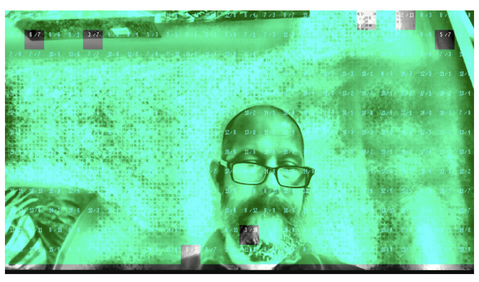

# castLabs Watermark (`whep-castlabs-watermark`)

This example is a standard `WHEPClient` subscribe flow with additional castLabs forensic watermark overlay integration.

It demonstrates how to:

- authenticate against castLabs watermark APIs,
- request overlay image(s),
- render the overlay(s) on top of live playback,
- capture screenshots for single-frame forensic extraction workflows.

For product context on castLabs forensic watermarking, see [STARDUSTmark](https://castlabs.com/image-watermarking/).

## Requirements

To use this example, you will need:

1. A castLabs account.
2. Your **Organization URN**.
3. A key created in castLabs account tools for watermark overlay API use:
   - **Access Key Id**
   - **Secret Access Key**
4. A valid **User URN** associated with your account/workflow.

## Settings

After the above is available, fill in the castLabs form in this example:

- `Access Key Id` - API key identifier.
- `Secret Access Key` - API key secret.
- `Organization URN` - organization identifier.
- `User URN` - user identifier.
- `Watermark Id` - watermark payload identifier to request.
- `Number of Overlays` - number of overlay image requests to perform.

Settings are persisted locally and restored on reload.

## Usage

1. Start a live broadcast from any publish example (16:9 is recommended, e.g. `640x360`).
2. Open this example and configure watermark credentials/settings.
3. Click `Start Subscribe`.
4. The example authenticates and requests overlay image(s), then subscribes and renders the overlay(s) on top of playback.
5. Use `Stop Subscribe` to stop playback and clear overlays.

## How This Example Works

At subscribe start, the example:

1. reads/saves form settings,
2. requests watermark overlay image(s) from castLabs service,
3. draws each returned PNG overlay over the subscriber video container,
4. initializes/subscribes with `WHEPClient`.

If overlay acquisition fails, subscribe is aborted and overlay state is reset.

## Single-Frame Watermark Forensics

Once playback and overlay are visible:

1. Take a screenshot of the live video area.
2. Upload the screenshot to castLabs watermark extraction tooling.
3. Run blind extraction (or other extraction mode your workflow uses).
4. Review extraction output and use recovered metadata in your forensic process.

> You may need to tune extraction settings in castLabs tooling depending on capture quality, scaling, and compression artifacts.



## Endpoint and `connectionParams`: Standalone vs Stream Manager

Watermark overlay behavior is independent from deployment mode. Endpoint and `connectionParams` follow the same WHEP pattern as other examples.

### Standalone Server

```ts
const endpoint = `https://${host}:443/live/whep/${streamName}`
const connectionParams = {}
```

### Stream Manager

```ts
const endpoint = `https://${host}/as/v1/proxy/whep/${app}/${streamName}`
const connectionParams = {
  // e.g. region, nodeGroup, auth metadata
}
```

## Where to Look in This Example

- subscribe flow: `startSubscribe()`
- overlay request path: `requestOverlays()`
- overlay render path: `addOverlay()`
- overlay reset path: `clearOverlays()`
- form persistence helpers: `src/lib/castlabs-watermark-configuration.ts`
- castLabs API wrapper: `src/service/castlabs.ts`
