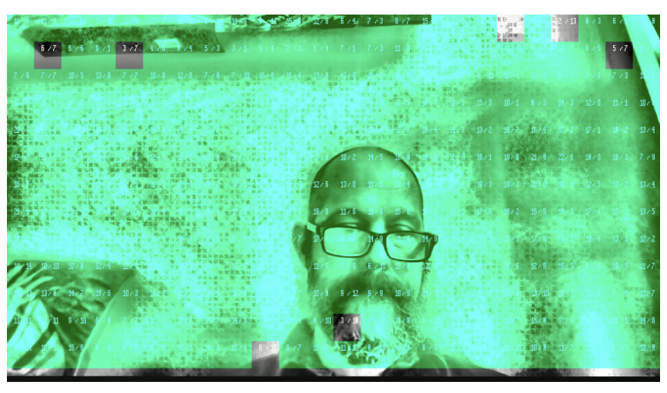

# Single Frame Forensic Watermarking with castLabs

This example demonstrates how to use [castLabs forensic watermarking](https://castlabs.com/image-watermarking/) to embed a watermark during a live broadcast.

# Requirements

In order to use this example, you will need to:

1. Create a castLabs account.
2. Access the Organization URN from your new account.
3. Go to [castLabs account](https://account.castlabs.com/account) and add a key for use with the watermark overlay REST API

## Settings

Once the above requirements are met, you will input the form values of the testbed example:

- `Access Key Id` - Key Id
- `Secret Access Key` - Key Secret
- `Organization URN` - Organization URN
- `User URN` - User URN

# Usage

1. Click on `Start` to begin credential authentication and watermark overlay request.
2. Once the watermark overlay request is complete, the watermarked image be overlayed on the live broadcast stream.

## Single-Frame Watermark Forensics

Once you have started a live stream, take a screenshot of the live video area to be used in your `castLabs` account for extraction.

1. Take a screenshot of the live video area.
2. Upload the screenshot to the [castLabs watermarking tool](https://watermark.castlabs.com/)
3. Select `Blink Extraction`
4. Upload the screenshot and allow for the extraction to process and complete.

> You may need to adjust the extraction settings to ensure the watermark is extracted correctly.

Once the system has completed the extraction, you will be able to download the watermarked image and use it in your forensic investigation.

