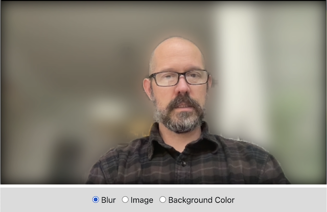
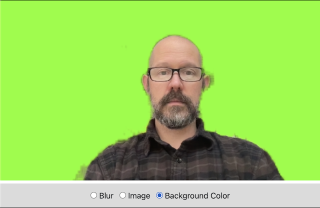

# Publish with Virtual Background

This is an example of using the `WHIPClient` of the SDK to publish a stream with virtual background support. With this example you can broadcast a stream and either:

- Provide a custom background color
- Provide a custom background image
- Blur the background of the camera input

## Example code

- **[index.html](index.html)**
- **[index.js](index.js)**

# Usage

This example utilizes [Insertable Streams](https://developer.mozilla.org/en-US/docs/Web/API/Insertable_Streams_for_MediaStreamTrack_API) to pipe the incoming video track through a transformer that modifies the background using Machine Learning (ML) with [MediaPipe Selfie Segmentation](https://chuoling.github.io/mediapipe/solutions/selfie_segmentation.html).

## Selfie Segmentation

Before we get into integrating with the Red5 Pro WebRTC SDK to send video with background replacement, let’s first look at the solutions available using the `OfflineCanvas` which will have drawing routines applied to incoming `VideoFrame` objects to be transformed through a processor.

The first step is to include the [MediaPipe Selfie Segmentation](https://chuoling.github.io/mediapipe/solutions/selfie_segmentation.html) library in our web application:

```html
<script
  src="https://cdn.jsdelivr.net/npm/@mediapipe/selfie_segmentation/selfie_segmentation.js"
  crossorigin="anonymous"
></script>
```

With the library loaded, a `SelfieSegmentation` class is accessible from the window global which can then be assigned a result handler to process the resulting mask:

```js
const onResults = (results) => {
  ctx.save()
  ctx.clearRect(0, 0, canvas.width, canvas.height)
  ctx.drawImage(results.segmentationMask, 0, 0, canvas.width, canvas.height)
  ctx.restore()
}

const selfieSegmentation = new SelfieSegmentation({
  locateFile: (file) =>
    `https://cdn.jsdelivr.net/npm/@mediapipe/selfie_segmentation/${file}`,
})
selfieSegmentation.setOptions({
  modelSelection: 1,
})
selfieSegmentation.onResults(onResults)
```

With this simple handler, you can see the segmentation mask being provided (red) and all other pixels transparent (showing the default white of the background).

To expand on this basic handling of the segmentation mask and drawing routines, this testbed example provides 3 options:

```js
if (selection === 'image') {
  ctx.globalCompositeOperation = 'source-out'
  const pat = ctx.createPattern(backgroundImage, 'no-repeat')
  ctx.fillStyle = pat
  ctx.fillRect(0, 0, canvasWidth, canvasHeight)

  ctx.globalCompositeOperation = 'destination-atop'
  ctx.drawImage(results.image, 0, 0, canvasWidth, canvasHeight)
} else if (selection === 'blur') {
  ctx.globalCompositeOperation = 'source-in'
  ctx.drawImage(results.image, 0, 0, canvasWidth, canvasHeight)

  ctx.filter = 'blur(15px)'
  ctx.globalCompositeOperation = 'destination-atop'
  ctx.drawImage(results.image, 0, 0, canvasWidth, canvasHeight)
} else {
  ctx.globalCompositeOperation = 'source-out'
  ctx.fillStyle = 'chartreuse'
  ctx.fillRect(0, 0, canvasWidth, canvasHeight)

  ctx.globalCompositeOperation = 'destination-atop'
  ctx.drawImage(results.image, 0, 0, canvasWidth, canvasHeight)
}
```






## Insertable Streams

The virtual background stream is generated using **Insertable Streams** in tandem with the [MediaPipe Selfie Segmentation].

We’ll first grab a MediaStream and setup our `MediaStreamTrackProcessor` and `MediaStreamTrackGenerator`:

```js
const media = await navigator.mediaDevices.getUserMedia({
  audio: true,
  video: {
    width: 640,
    height: 360,
  },
})
const audioTrack = media.getAudioTracks()[0]
const videoTrack = media.getVideoTracks()[0]

const trackProcessor = new MediaStreamTrackProcessor({ track: videoTrack })
const trackGenerator = new MediaStreamTrackGenerator({ kind: 'video' })
```

These will be used to pipe the video through a transformer function which utilizes the `SelfieSegmentation` and set the modifications from the canvas as the next VideoFrame on the outgoing generated stream:

```js
const transformer = new TransformStream({
  async transform(videoFrame, controller) {
    const { displayWidth, displayHeight, timestamp } = videoFrame
    videoFrame.width = displayWidth
    videoFrame.height = displayHeight
    await selfieSegmentation.send({ image: videoFrame })

    const frame = new VideoFrame(canvas, { timestamp })
    videoFrame.close()

    controller.enqueue(frame)
  },
})
trackProcessor.readable.pipeThrough(transformer).pipeTo(trackGenerator.writable)
```

While the video track is running, each frame is sent to the `SelfieSegmentation` which results in the segmentation mask provided to the `onResult` handler where we apply our drawing routines for virtual background. While that happens we are setting the canvas element as the next VideoFrame image written on the generator.

The result of such can be assembled as a new `MediaStream` to define as the stream source for a Red5 Pro publisher (in this case, a `WHIPClient`):

```js
const stream = new MediaStream([trackGenerator, audioTrack])

publisher = new WHIPClient()
publisher.on('*', onPublisherEvent)
await publisher.initWithStream(config, stream)
await publisher.publish()
```

That ensures that all our desired virtual background transformations are applied to the stream prior to being sent to the Red5 server.

## Gotchas

- The Insertable Streams APIs used in this example are considered experimental and only have adopted support on Chrome and Edge. You will need to include the 3rd-party polyfills described in [index.html](index.html) for your own project in order to properly provide virtual backgrounds.
- At the time of this writing, Safari does not support filter effects on `context2d`, so the blur on the background example will not work on that browser.
